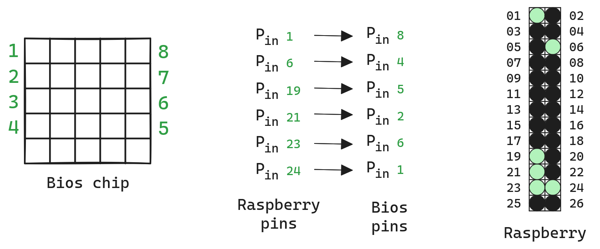
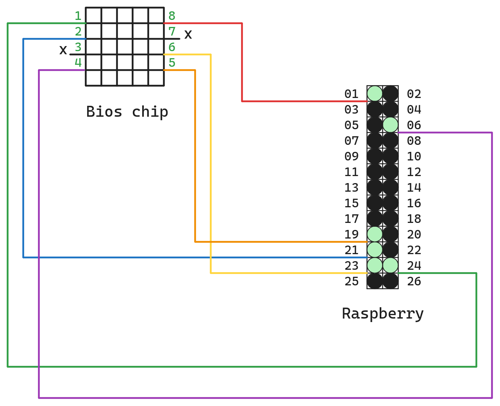
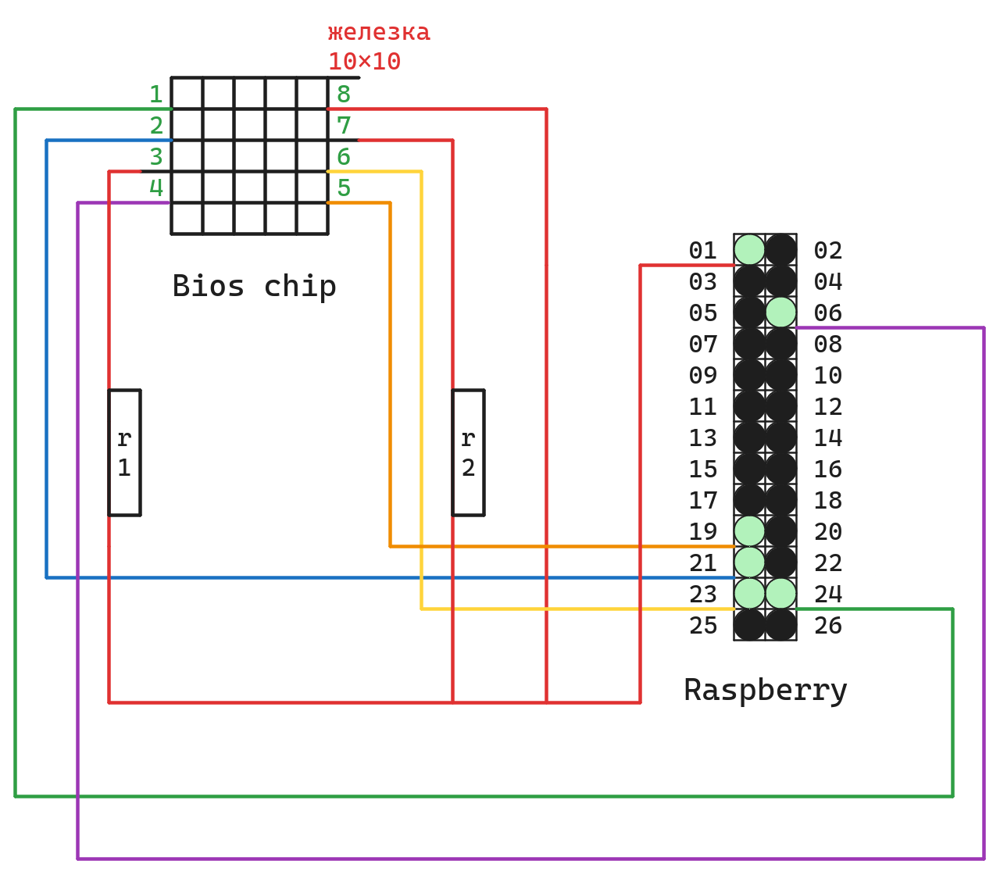

# Libreboot

<!--toc:start-->
- [Libreboot](#libreboot)
  - [Введение](#введение)
  - [Ноутбук](#ноутбук)
    - [Магазин или частное лицо?](#магазин-или-частное-лицо)
  - [Чип](#чип)
    - [Замена чипа](#замена-чипа)
  - [Прошивка](#прошивка)
    - [Первый вариант](#первый-вариант)
    - [Второй вариант](#второй-вариант)
    - [Прошивка](#прошивка)
<!--toc:end-->

Подробнейший мануал на русском по прошивке ноутбуков `x200s` и `x200` на GNU загрузчик.

## Введение

Это был для меня трудоёмкий путь длиной в 2 месяца (ещё не завершился). Я пишу его скорее для себя в будущее, т.к сейчас приостановил работу над этим проектом из-за отсутствия ресурсов. Чувствую, что вернусь я к нему не скоро, и поэтому хочу изложить здесь мысли, скопившиеся у меня за все время.

---

Предлагаю разделить эту большую задачу на несколько подпунктов. Думаю, так будет намного легче.

Для прошивки понадобится:

1) [Ноутбук](#ноутбук) `x200` или `x200s`.
2) [Чип](#чип).
3) Raspberry Pi 3 B+.

## Ноутбук

Эту модель, соглашусь, достать не так уж и просто. Но мне повезло: я нашёл магазин...[^1].

> Совет: лучше брать ноутбуки из ломбарда или из магазина. Компании больше заботятся о сохранении изделия. Но при этом цена может быть выше.

### Магазин или частное лицо?

Очень хороший вопрос, т.к я вспомнил одну неутешительную вещь с моим ноутбуком. При разборе я увидел, что почти все комплектующие были из **разных моделей**. Следует обратить на это внимание, т.к есть вероятность, что *Libreboot* не будет совместим с каким-нибудь дисплеем от `t400`.

В этом плане выигрывает взять у подпивасного Васяна, который этот ноутбук ни разу не раскручивал. Но ноутбук от Васьки Вы берете на свой **страх и риск** (но это лучше, чем обосраться с магазином).

Не буду углубляться в подробности, т.к. в интернете есть множество мануалов, как проверить и клавиатуру и батарею. Просто вводите: "Как правильно купить ноутбук на авито" и впитываете информацию.

От себя могу добавить, как человек, смотревший на этот ноутбук изнутри, что его почти нереально убить. И что если есть в нем какие-то повреждения, то их будет видно сразу же. Но будь **внимателен!**

## Чип

Собственно вот, мы купили ноутбук, что делать дальше?

Надо понимать, где расположен Bios. Он расположен в отдельном чипе и находится этот чип на материнской плате[^2]. Рассмотрим вариант замены чипа.

### Замена чипа

Для этого понадобится полностью новый, **чистый** чип. 

Название: **W25Q128FVSIG**(norFlash). Свой брал в *ChipDip*. Но тут есть свои нюансы.

В самый последний момент на сайте я увидел, что есть 2 абсолютно одинаковых чипа, только чуть различающиеся в цене и названии:

1. Вариант:  
  **W25Q128FVSIG** микросхема памяти NOR Flash S08 (цена 480 руб).

2. Вариант:  
  **W25Q128FVSIG** микросхема памяти Flash 1 (цена **?** руб).

Прошу обратить внимание на 2 вариант. Сейчас перепроверил его по сайту - его нигде нет, но я помню, что он стоил на 200-150 рублей дороже. Также есть его фото в телефоне. К чему это всё? Я **не знаю** какой надо брать чип из этих двоих. Поэтому я взял оба. И прошил оба.

Ну вот, у нас на руках есть чип. Что дальше?

## Прошивка

Дальше прошивка. Точнее подготовка Raspberry Pi 3 B+.

Почему именно эта модель не знаю, в удаленном виде основателя Libreboot была именно эта модель. В общем рекомендуется взять ее. Дальше следует подключение чипа к Raspberry Pi. Есть 2 варианта.

1) Ты подключаешь Raspberry Pi к чипу **на плате**.
2) Ты подключаешь Raspberry Pi к чипу **не на плате**.

### Первый вариант

При подключении Raspberry Pi к чипу на плате **не требуется подключать 3 и 7 порт**. Также здесь **не используется** резистор для подключения. Также **не надо** использовать **заземление 8-20 пина**. Но если ты очень хитрый (нет) ты можешь подумать: "Зачем тогда прошивать чип отдельно от платы, если можно сразу же отпаять старый, припоять новый и прошить его с платы?". В теории это возможно, но на практике никто не проверял.

Подключение для **первого** варианта изображено ниже[^3].



Должно получиться примерно вот так:



### Второй вариант

Рассмотрим 2-й вариант.

Всё тоже самое, но надо подключить заземление к 8-му пину на чипе и к 8-му пину подключить 7-й и 3-й пин через резистор от 1 **Kohm** до 10 **Kohm**.

По поводу заземления... Нужно использовать любую железку. Покажу на картинке.



### Прошивка

Собственно, вот мы подключили чип дальше прошивка. Здесь все тоже не просто. Я следовал многим инструкциям. В итоге идеально ни одна не подошла, поэтому я выработал собственную.

> Примечание: следует **обновить BIOS** до последней версии перед прошивкой.

Будем опираться на ту, что расположена на *Libreboot* [сайте](https://libreboot.org/docs/install/spi.html).

На нём спускаемся до пункта *install flashrom*.

Здесь приведен список команд с сайта, чтобы установить. Каждую из них я скорректирую и прокомментирую, поэтому я их выпишу.

```bash
cd lbmk
sudo ./build dependencies ubuntu2004
./download flashrom
./build module flashrom
```

> Примечание от *НЕ* автора, файла `download` в репозитории `lbmk` я не нашёл.

Во-первых, что хотелось бы отметить, надо скопировать файл `lbmk`. Почему они это не написали **нормально** я не знаю.

```bash
git clone https://notabug.org/libreboot/lbmk
```
> Примечание от *НЕ* автора, команда выше возвращает 504 ошибку, попробуйте `git clone https://codeberg.org/libreboot/lbmk`, если и эта команда не склонирует репозиторий, то вам сюда [lbmk (libreboot-make)](https://libreboot.org/git.html#lbmk-libreboot-make).

1) Команда выполняет переход в скопированную директорию. Претензий нет.
2) Должна выполнять компилирование нужных для работы утилит. Но здесь не всё так гладкою Мягко говоря (~~Я просрал на это говно 3 недели своей жизни~~). Здесь есть маленький нюанс, который я понял через некоторое время. Не буду нагружать тебя всем, что я перепробовал, просто скажу, что нужно делать.

Зайти в файл зависимостей:

```bash
cd lbmk
sudo nano source/dependencies/ubuntu2004
```

> Примечание от *НЕ* автора: опять же, в статье автора указано про другой путь `sudo nano resources/scripts/.../ubuntu2004`.
> Актуальный список зависимостей на 25/07/24, который был в файле `source/dependecies/ubuntu2004` представлен ниже.

```txt
autoconf autogen automake autopoint autotools-dev bc binutils-arm-none-eabi bison build-essential cmake curl device-tree-compiler doxygen e2fsprogs efitools flex gawk gcc-arm-linux-gnueabi gcc-arm-none-eabi gdb gettext git gnat help2man innoextract libdevmapper-dev libfdt-dev libfont-freetype-perl libfreetype6-dev libftdi-dev libfuse-dev libgnutls28-dev liblz4-tool liblzma-dev libncurses5-dev libncurses-dev libnewlib-arm-none-eabi libopts25 libopts25-dev libpci-dev libpython3-dev libsdl2-dev libselinux1-dev libssl-dev libtool libusb-1.0-0 libusb-1.0-0-dev lz4 lzma lzma-alone m4 nasm openssl p7zip p7zip-full parted pciutils perl pkg-config python3 python3-distutils python3-pkg-resources python3-pycryptodome python3-pyelftools python3-setuptools python-is-python3 sharutils swig ttf-unifont unar unifont unzip uuid-dev wget zlib1g-dev ccache
```

Устанавливается каждый пакет через `apt-get -y install <Название пакета>`.

Некоторые команды могут выдавать ошибки. Это нормально.

Что хотелось бы добавить к этим командам? Некоторые из них не работают. После выполнения этих команд следует выйти обратно в корень папки `/lbmk` и выполнить компиляцию модуля flashrom, перед этим скачав его. Вот так это должно выглядеть:

```bash
./download flashrom
./build module flashrom
```

Если Вы верно...а, да. По поводу команд... Для тупых: в одном окошке терминала открываете директорию в которой находится список зависимостей (
у меня, не автора, например это `source/dependencies/ubuntu2004`). В другом открывает терминал в `/lbmk/` и копируем команды из одного терминала в другой и выполняем их по одной. Если все команды были выполнены верно, то при команде `./build module flashrom` Вы увидите безумное количество букв и цифр, которые заполняют ваш экран терминала на пару секунд. Это была компиляция flashrom.

Что мы имеем на данный момент? Мы можем:

1) Подключить чип к Raspberry Pi.
2) Имеем прогу для прошивки чипа.

Что осталось?

1) Скачать `libreboot` прошивку для чипа.
2) Загрузить эту прошивку в чип.
3) Вставить чип в ноутбук.

Прежде чем выполнить пункт 1, следует убедиться, что flashrom видит наш чип.

> **Обратите внимание**: желательно, если чипу подается питание сразу же с включением машины, т.е вот машина без питания, но с подключенным чипом. Берем и подключаем это к питанию.

```bash
cd lbmk
cd flashrom
sudo ./flashrom -p linux_spi:dev=/dev/spidev0.0,spispeed=32768
```

> **Обратите внимание**: последняя команда `./flashrom -p linux_spi:dev=/dev/spidev0.0,spispeed=32768` скорее всего была криво переписана, поэтому сверяйтесь с мануалом.

После этой команды мы можем выделить 2 важных вещи:

1) Название чипа.
2) Кол-во Кб.

Далее мы:

1) Скачиваем нужный файл прошивки с официального сайта (в *install* будет несколько окон, выбираешь первое, потом сам поймешь).
2) Скачав, разархивируешь.
3) Скачиваешь туда, где установлен flashrom.
4) Команда есть по записи прошивки. Туда вставляешь в `/путь/` путь к разархивированному файлу и название чипа, если надо. В принципе всё...

[^1]: Данную информацию анон не разглашает.
[^2]: Нам нужно **поменять** чип и **прошить** его.
[^3]: **Зеленым** отмечаю те порты на Raspberry Pi, которые использую.
